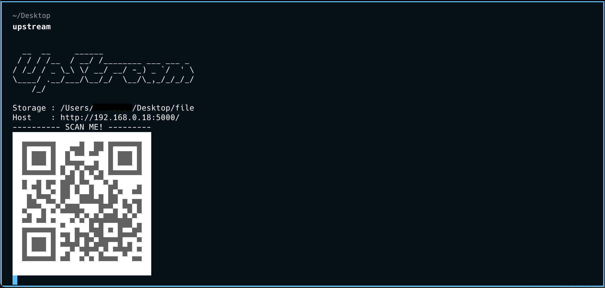

# upstream

Upstream: A Tool for Sending Files from Client to Server on Local only.

## Using



## Install

### Install with Homebrew

```shell
brew update
brew tap prongbang/homebrew-formulae
brew install upstream
```

## 🙏 Acknowledgments

- Built with Rust 🦀
- IDE Support by [RustRover](https://www.jetbrains.com/rust/)


---